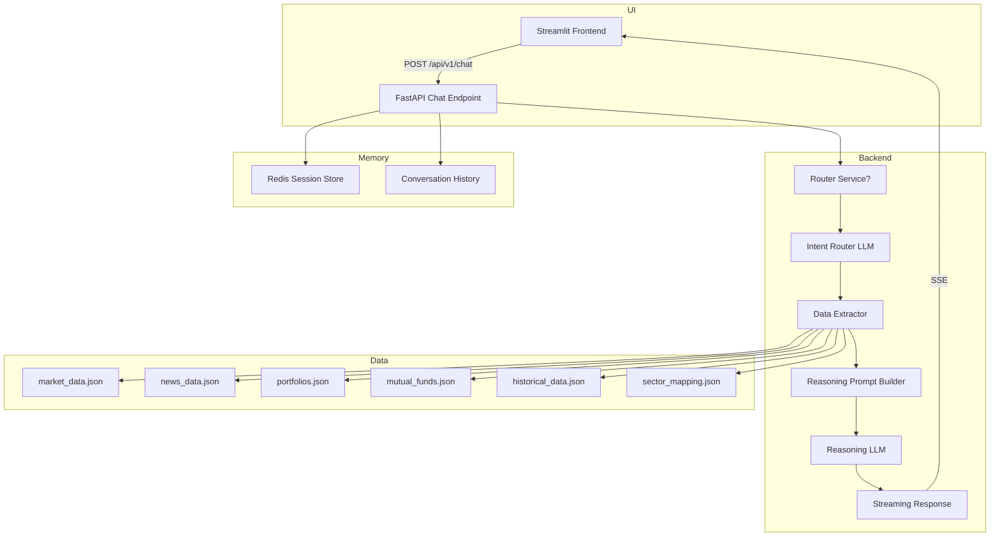

# Autonomous Financial Advisor System Design

## Overview

This document describes the full system architecture for the Autonomous Financial Advisor Chat Agent built in this repository.

The system is designed as a modular two-LLM pipeline:

1. **Intent Router**: small/fast model that classifies the user query and returns structured routing JSON.
2. **Data Extractor**: pure Python filter over in-memory datasets, using the router output to fetch only required rows and fields.
3. **Reasoning Model**: large model that receives the filtered data, user query, compact context, and conversation history to generate the final answer.

The frontend connects only to the streaming `POST /api/v1/chat` endpoint. The router endpoint is internal/system-facing.

---

## Goals

- Deliver causal, explainable portfolio reasoning rather than raw data summaries.
- Keep local CPU and memory usage low by offloading inference to Groq cloud.
- Use two separate LLM stages to minimize cost and speed up intent classification.
- Load all JSON data once at startup and keep it in memory for fast pure-Python extraction.
- Stream final responses token-by-token to the UI.

---

## High-Level Architecture



---

## Data Flow

### 1. User query arrives

The user interacts through the Streamlit frontend. The frontend submits the query to `POST /api/v1/chat` along with `session_id` and optionally `portfolio_id`.

### 2. Router call

The backend uses the Intent Router model to classify the query and return structured routing JSON only.

The router decision includes:

- `intent` type: portfolio, stock, sector, mutual fund, news, market, or mixed
- requested portfolio IDs
- requested stock symbols
- requested sectors
- requested mutual fund IDs
- requested market blocks (indices, sector_summary, stock_summary)
- requested news scope (market-wide, sector-specific, stock-specific)
- requested field groups for each dataset
- a short `reasoning` description of why this route was selected

The router response is strict JSON with no markdown or free-form answer.

### 3. Data extraction

After the router outputs JSON, the Data Extractor filters the in-memory dataset and returns compact data.

This stage:

- uses only one in-memory dataset load at startup
- avoids re-reading files per request
- selects rows and fields based on the router plan
- returns minimal JSON payload for the final reasoning prompt

### 4. Reasoning prompt construction

The Reasoning Prompt Builder composes a final prompt containing:

- the original user query
- the filtered dataset
- compact context summary for market, portfolio, and news
- recent conversation history from Redis

This prompt is sent to the Reasoning LLM.

### 5. Final answer generation

The Reasoning LLM produces the final user-facing response, which includes:

- causal explanation
- portfolio impact reasoning
- news-to-sector-to-stock mapping
- risk summary and watch points

The final answer is streamed back to Streamlit as SSE tokens.

---

## Backend Architecture

### API Endpoints

- `POST /api/v1/router`
  - Non-streaming
  - Internal router call only
  - Returns structured JSON with routing decisions

- `POST /api/v1/chat`
  - Streaming endpoint for final answers
  - Performs full pipeline:
    - intent routing
    - data extraction
    - reasoning prompt creation
    - streamed response generation

- `GET /api/v1/health`
  - Health check for the service

- `GET /api/v1/portfolios`
  - Returns available portfolio summaries

- `GET /api/v1/portfolios/{portfolio_id}`
  - Returns a single portfolio object

### Core Modules

- `backend/config.py`
  - Loads `.env` configuration with pydantic-settings
  - Defines router and reasoner model settings separately
- `backend/dependencies.py`
  - Provides DI for Redis session store and both Groq clients
- `backend/groq_client/client.py`
  - Handles both streaming and non-streaming model calls
  - Supports JSON-only response parsing for router output
- `backend/intelligence/data_loader.py`
  - Loads all JSON files once at startup
  - Normalizes portfolios keyed by ID
- `backend/intelligence/market_intelligence.py`
  - Parses market indices and sector performance
- `backend/intelligence/news_processor.py`
  - Normalizes news articles and identifies relevant items
- `backend/intelligence/portfolio_analytics.py`
  - Computes P&L, allocation, and concentration risk
- `backend/memory/session_manager.py`
  - Redis-backed or in-memory session store with TTL
- `backend/memory/conversation_manager.py`
  - Loads and appends history with pruning

### Agent Orchestration

The agent orchestration layer is responsible for the pipeline sequencing and consists of:

- Intent Router call
- Data extraction from memory
- Reasoning prompt creation
- Calling the reasoner model
- Streaming tokens to the frontend
- Appending conversation history after completion

---

## Dataset Schema Summary

### `market_data.json`

Top-level keys:

- `metadata`
- `indices` (mapped by index symbol)
- `sector_performance` (mapped by sector name)
- `stocks` (mapped by stock symbol)

### `news_data.json`

Top-level keys:

- `metadata`
- `news` (list of article objects)

Article object includes:

- `id`, `headline`, `summary`, `published_at`, `source`
- `sentiment`, `sentiment_score`
- `scope` (`MARKET_WIDE`, `SECTOR_SPECIFIC`, `STOCK_SPECIFIC`)
- `impact_level` (`HIGH`, `MEDIUM`, `LOW`)
- `entities`: `sectors`, `stocks`, `indices`, `keywords`
- `causal_factors`

### `portfolios.json`

Top-level keys:

- `metadata`
- `portfolios` (dict keyed by `PORTFOLIO_001`, `PORTFOLIO_002`, ...)

Each portfolio object contains:

- `user_id`, `user_name`, `portfolio_type`, `risk_profile`
- `total_investment`, `current_value`, `overall_gain_loss`, `overall_gain_loss_percent`
- `holdings`:
  - `stocks` list
  - `mutual_funds` list

Stock holdings include:

- `symbol`, `name`, `sector`, `quantity`, `avg_buy_price`
- `current_price`, `investment_value`, `current_value`
- `gain_loss`, `gain_loss_percent`, `day_change`, `day_change_percent`
- `weight_in_portfolio`

Mutual fund holdings include:

- `scheme_code`, `scheme_name`, `category`, `amc`
- `units`, `avg_nav`, `current_nav`, `investment_value`, `current_value`
- `gain_loss`, `gain_loss_percent`, `day_change`, `day_change_percent`
- `weight_in_portfolio`, `top_holdings`

### `mutual_funds.json`

Top-level keys:

- `metadata`
- `mutual_funds` (dict keyed by scheme code)

Each fund object includes:

- `scheme_name`, `amc`, `category`, `risk_rating`
- `current_nav`, `previous_nav`, `nav_change`, `nav_change_percent`
- `returns` by timeframe
- `top_holdings` with stock weights and sectors
- `sector_allocation`
- `portfolio_characteristics`

### `historical_data.json`

Top-level keys:

- `metadata`
- `index_history`
- `stock_history`
- `sector_weekly_performance`

Each history entry includes:

- daily close values, change percent, trend, support/resistance
- summary metrics like trend duration and volatility

### `sector_mapping.json`

Top-level keys:

- `metadata`
- `sectors` (sector definitions, sub-sectors, stocks)
- `macro_correlations`
- `defensive_sectors`, `cyclical_sectors`, `rate_sensitive_sectors`, `export_oriented_sectors`

This file is used to relate stock symbols to sectors and support causal reasoning.

---

## Detailed Request Flow

### Router Stage

1. Backend receives `POST /api/v1/chat`.
2. The router model is invoked with a prompt that asks only for a strict JSON routing plan.
3. Router output includes the query type and exact requested dataset slices.
4. The router does not generate any user-facing text.

Example router response:

```json
{
  "intent": "PORTFOLIO_QUERY",
  "portfolios": ["PORTFOLIO_002"],
  "stocks": ["HDFCBANK","ICICIBANK"],
  "sectors": ["BANKING"],
  "market": ["indices","sector_performance"],
  "news": ["banking"],
  "reasoning": "User asks why the banking-heavy portfolio is down today."
}
```

### Extraction Stage

1. Read the in-memory dataset store.
2. Fetch only the requested portfolio objects.
3. Filter `news` articles by requested sectors/stock symbols/scope.
4. Select only requested market blocks such as `indices` or `sector_performance`.
5. Return compact JSON containing only the requested fields and rows.

This stage is deterministic Python logic with no LLM calls.

### Reasoning Stage

1. Build a compact reasoning prompt with:
   - user query
   - filtered dataset
   - selected market/news/portfolio context
   - prior conversation history
2. Call the larger reasoning model.
3. Stream the final answer back to the UI.

The reasoning model is responsible for:

- causal explanation
- evidence-backed reasoning
- risk summary
- any follow-up guidance

---

## Frontend Architecture

- `frontend/app.py`
  - Streamlit main app
  - manages `session_state`
  - renders portfolio selector and chat window
  - sends chat payloads to `/api/v1/chat`

- `frontend/utils/api_client.py`
  - handles HTTP requests
  - streams SSE tokens from `/api/v1/chat`
  - does not call `/api/v1/router`

- `frontend/components/`
  - chat rendering
  - portfolio sidebar
  - market snapshot panel

The frontend only consumes the streaming chat endpoint.

---

## Data Layer

### In-memory dataset cache

All JSON files are loaded at startup by `backend/intelligence/data_loader.py` and cached via `functools.lru_cache()`.

This avoids repeated disk reads and ensures request performance is fast.

### Key dataset normalization rules

- `portfolios.json` is normalized from its keyed object shape into `portfolio_id`-aware objects.
- `holdings` may be nested as `stocks` and `mutual_funds`.
- `market_data.json` uses dictionaries for indexes and sectors.
- `news_data.json` uses entity tags for sector and stock relevance.

---

## Memory and Persistence

- `backend/memory/session_manager.py`
  - loads Redis first via `redis.asyncio`
  - if Redis is unavailable, falls back to `InMemorySessionStore`
  - writes session data under keys like `session:{session_id}`
  - stores serialized JSON message arrays with TTL
  - also provides `resp:{key}` caching for temporary response reuse and `title:{session_id}` storage
- `backend/memory/conversation_manager.py`
  - `load(session_id)` reads the saved message list from the session store
  - `append(session_id, role, content)` adds a new message
  - history is pruned to the last `max_turns * 2` messages (user + assistant pairs)
  - only the most recent conversation turns are included in the next prompt

### Session lifecycle

1. When `/api/v1/chat` receives a request, the backend resolves the session store dependency.
2. `ConversationManager.load()` fetches prior messages from Redis or in-memory cache.
3. The latest user query is appended locally while the router and reasoning pipeline run.
4. As the Reasoning model generates the final answer, tokens stream back to the client.
5. After completion, `ConversationManager.append()` saves the assistant response into the same session history.

### Redis vs in-memory fallback

- `RedisSessionStore` uses `SETEX` to save `session:{session_id}` with TTL configured in `.env` (`SESSION_TTL_SECONDS`).
- `InMemorySessionStore` keeps session data in a Python dict with expiration timestamps.
- Both stores expose `get_messages()` and `set_messages()` with identical interfaces.
- This makes memory transparent to the rest of the backend.

### Why memory matters

- It enables multi-turn dialogue by injecting recent history into the reasoning prompt.
- It avoids rebuilding the entire conversation state from scratch.
- By pruning to the last few turns, it keeps prompts compact and within model token limits.

---

## Observability and Resilience

The system is designed to support:

- structured logging via `structlog`
- retryable LLM calls via `tenacity`
- error handling for routing and reasoning failures
- Langfuse integration for tracing (if configured)

---

## Deployment and Environment

Required files:

- `.env` with API keys and database/service settings
- `requirements.txt`
- `docker-compose.yml`
- `Dockerfile`

Important `.env` keys:

- `GROQ_API_KEY`
- `GROQ_ROUTER_MODEL`
- `GROQ_REASONER_MODEL`
- `REDIS_URL`
- `DATABASE_URL`
- `API_BASE_URL`
- `LOG_LEVEL`
- `ENVIRONMENT`

---

## Design Principles

- **Separation of concerns**: routing, extraction, reasoning, UI, and memory are separate layers.
- **Two-stage inference**: keep intent classification cheap and final generation rich.
- **Minimal prompt data**: only required fields are sent to the reasoning model.
- **No data re-read per request**: all datasets are cached in memory.
- **Frontend isolation**: UI only hits the chat stream endpoint.

---

## Notes

This doc reflects the system intent and current repository structure. The key improvement over the initial single-pass model is the explicit two-stage LLM architecture: `Router → Extractor → Reasoner`.
